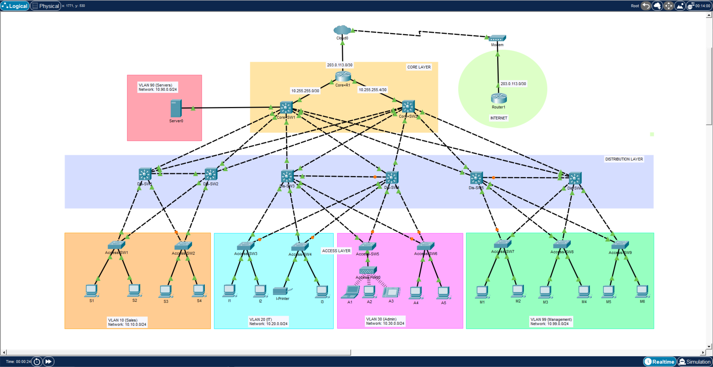

# Enterprise-Hierarchical-Network

## 📌 Project Overview

This project demonstrates the design, implementation, and verification of a scalable three-tier enterprise network using the **Core, Distribution, and Access** hierarchical model.

The environment implements VLAN segmentation, Layer 2 redundancy, dynamic routing, centralized DHCP services, inter-VLAN routing, and PAT for secure external connectivity.

---

## 📊 Network Topology



---

## 🛠️ Technical Specifications

### 1. Network Architecture

- **Hierarchical Design:** Core, Distribution, and Access layers provide a structured and scalable enterprise topology.
- **Segmentation:** Five VLANs separate Sales, IT, Admin, Servers, and Management traffic.
- **Redundancy:** Rapid PVST+ provides loop prevention and redundant Layer 2 paths.
- **Discovery:** LLDP is enabled across network infrastructure for neighbor discovery.

### 2. Routing & Connectivity

- **Dynamic Routing:** OSPF Area 0 provides routing between CORE-R1, CORE-SW1, and CORE-SW2.
- **Inter-VLAN Routing:** SVIs on the multilayer core switches provide Layer 3 connectivity between VLANs.
- **STP Load Balancing:** CORE-SW1 is preferred for VLANs 10, 30, and 90, while CORE-SW2 is preferred for VLANs 20 and 99.
- **Default Route:** CORE-R1 advertises the external default route into OSPF using `default-information originate always`.

### 3. Infrastructure Services

- **DHCP:** CORE-R1 provides centralized DHCP services for Sales, IT, and Admin VLANs.
- **DHCP Relay:** `ip helper-address` forwards client DHCP broadcasts from the core SVIs to CORE-R1.
- **802.1Q Trunking:** VLANs 10, 20, 30, 90, and 99 are carried across inter-switch trunk links.
- **PAT/NAT:** Internal `10.0.0.0/8` traffic is translated through the CORE-R1 outside interface.
- **External Testing:** INTERNET-R1 provides a simulated Internet destination at `100.100.100.100/32`.

---

## 📊 Verification Results

### Connectivity

Successful end-to-end ICMP connectivity was verified from internal client networks to the simulated Internet destination:

`100.100.100.100`


---

### NAT/PAT Translation

Active PAT sessions were verified on CORE-R1 using:

```text
show ip nat translations
